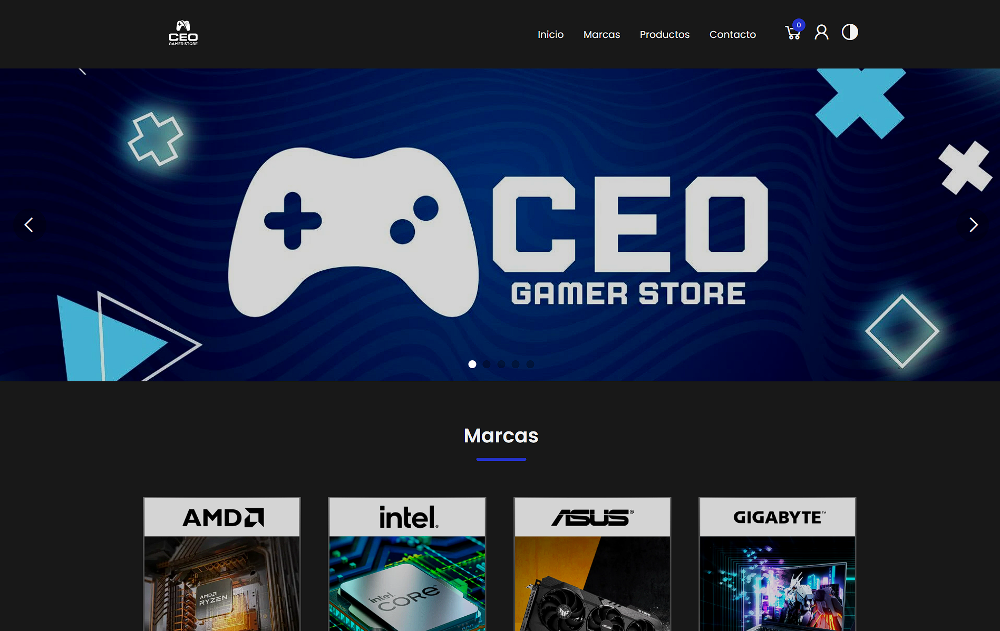
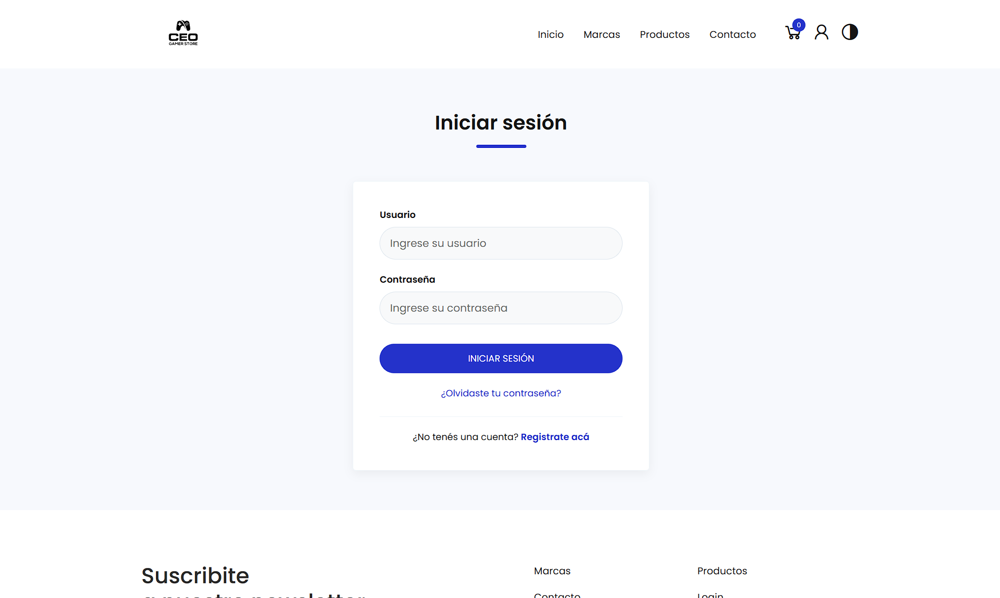
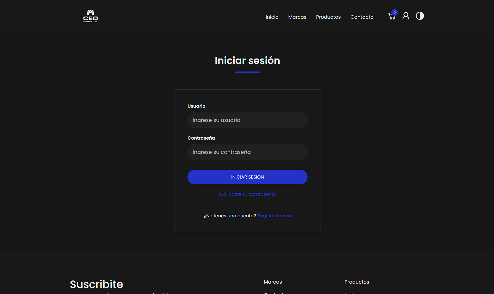
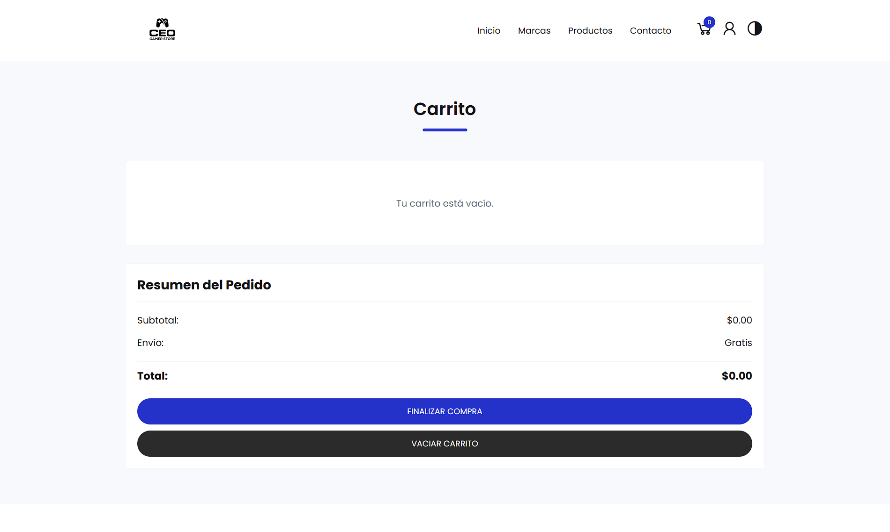
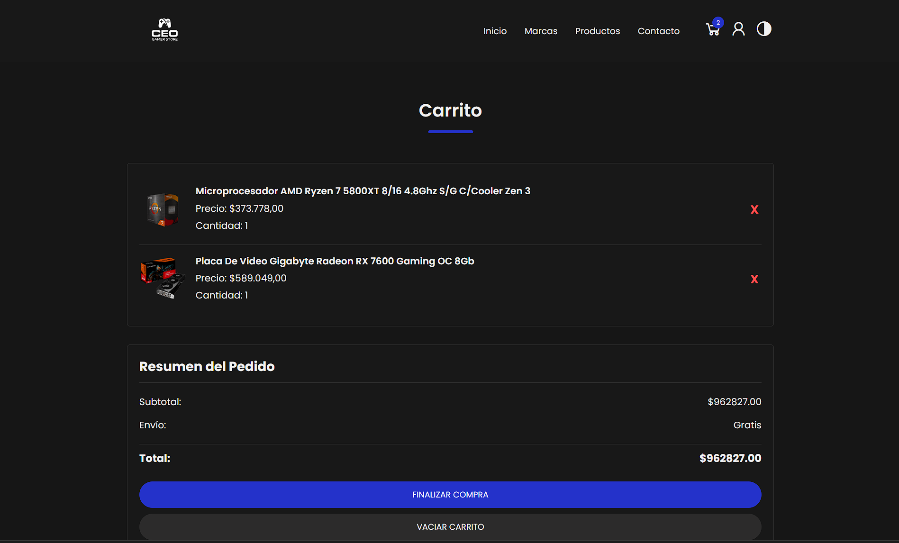
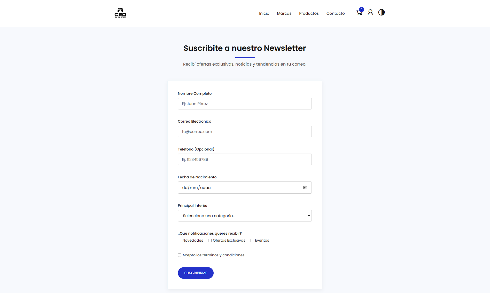
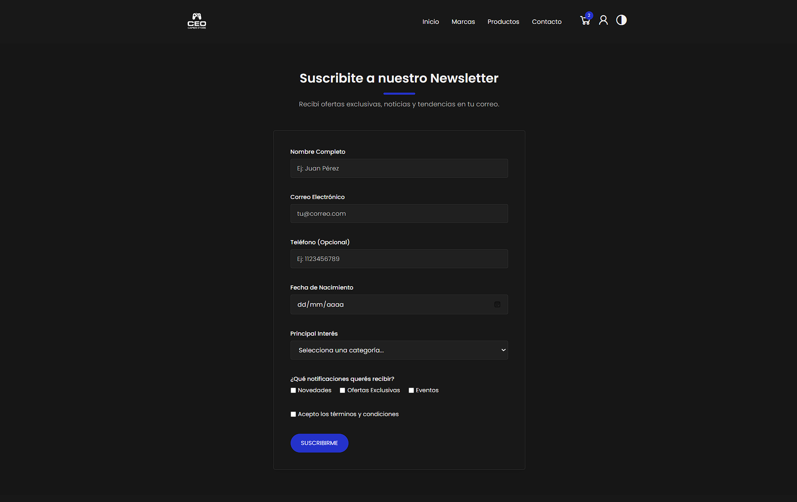

# CEO Gamer Store - Trabajo Práctico I - Programación II - TUP - UTN


## Descripción

**CEO Gamer Store** es un proyecto de e-commerce frontend (sin backend real) desarrollado como trabajo práctico para la materia **Programación II** de la Tecnicatura Universitaria en Programación (TUP). Se trata de una tienda online de componentes de hardware y periféricos para gamers, diseñada para ser funcional, visualmente atractiva y fácil de usar.

La página cuenta con varias funcionalidades clave:
-   **Catálogo de Productos:** Visualización de productos organizados por categorías y pestañas.
-   **Carrito de Compras:** Permite a los usuarios agregar, eliminar y vaciar productos. El estado del carrito se guarda localmente usando `localStorage`.
-   **Modo Oscuro:** Un interruptor de tema que permite cambiar entre un diseño claro y uno oscuro, guardando la preferencia del usuario.
-   **Login Simulado:** Un sistema de inicio de sesión que se comunica con un servidor local simulado para validar usuarios.
-   **Diseño Responsivo:** La interfaz se adapta a diferentes tamaños de pantalla, desde móviles hasta escritorios.
-   **Formulario de Suscripción:** Una página de contacto con validación de campos en tiempo real.

## Tecnologías Utilizadas

-   **Frontend:**
    -   HTML5
    -   CSS3 (con Variables CSS para el sistema de temas)
    -   JavaScript (Vanilla JS, ES6+)
-   **API & Persistencia:**
    -   **`localStorage`**: Para persistir el carrito de compras y la preferencia del modo oscuro.
    -   **`json-server`**: Para simular una API RESTful y gestionar los datos de los usuarios para el login.
-   **Librerías y Herramientas:**
    -   **AOS (Animate On Scroll)**: Para animaciones de aparición de elementos al hacer scroll.
    -   **Font Awesome / Line Awesome**: Para la iconografía.
    -   **Google Fonts**: Para la tipografía (Poppins).

## Funcionalidades Implementadas

El proyecto cumple con todos los requisitos mínimos de la consigna, incluyendo:

-   **Estructura y Maquetación:**
    -   4 páginas HTML (`Inicio`, `Login`, `Carrito`, `Newsletter`) con estructura semántica.
    -   Maquetación avanzada combinando CSS Flexbox y Grid.
    -   Uso de imágenes optimizadas en formato `.webp` y favicon personalizado.

-   **Formulario Avanzado:**
    -   Formulario de suscripción con 8 campos de distintos tipos.
    -   Validación de datos en tiempo real y feedback visual para el usuario.
    -   Simulación de envío de datos a un mock API (`json-server`) mediante Fetch.

-   **Diseño Responsivo y Tematización:**
    -   Diseño adaptable a 4 tamaños de pantalla (móvil, tablet, laptop y desktop).
    -   Menú de navegación tipo "hamburguesa" para dispositivos móviles.
    -   Modo claro y oscuro con persistencia de la preferencia del usuario en `localStorage`.

-   **Efectos y Animaciones:**
    -   Micro-interacciones en botones, enlaces y tarjetas de producto.
    -   Animaciones de aparición de elementos al hacer scroll (AOS).
    -   Transiciones suaves entre páginas y un pre-loader inicial.

## Extras Implementados

Además de los requisitos mínimos, el proyecto incluye la siguiente funcionalidad extra:

-   **Carrito de Compras:** Implementación completa de un carrito de compras funcional que persiste los productos seleccionados por el usuario a través de las sesiones utilizando `localStorage`.

## Instrucciones para Ejecutar el Proyecto

Para poder probar todas las funcionalidades (especialmente el login), es necesario levantar un servidor local.

### Prerrequisitos

-   Tener Node.js instalado en tu sistema.

### Pasos

1.  **Clonar el Repositorio**
    ```bash
    git clone https://github.com/tu-usuario/CEO-Gamer-Store-TUP.git
    cd CEO-Gamer-Store-TUP
    ```

2.  **Instalar JSON Server**
    Abre una terminal en la carpeta raíz del proyecto y ejecuta el siguiente comando para instalar la dependencia que simulará nuestra API.
    ```bash
    npm install -g json-server
    ```

3.  **Iniciar el Servidor**
    En la misma terminal, ejecuta el siguiente comando para iniciar el servidor. Este leerá el archivo `db.json` para obtener los datos de los usuarios.
    ```bash
    json-server --watch db.json
    ```
    El servidor se iniciará en `http://localhost:3000`. **Es importante mantener esta terminal abierta** mientras se utiliza la funcionalidad de login.

4.  **Abrir la Página**
    Simplemente abre el archivo `index.html` en tu navegador web. ¡Y listo! Ya podés navegar por la tienda.

## Capturas de Pantalla

### Página de Inicio (Modo Claro y Oscuro)



### Página de Login (Modo Claro y Oscuro)



### Carrito de Compras (Modo Claro y Oscuro)

]

### Formulario de Suscripción (Modo Claro y Oscuro)

